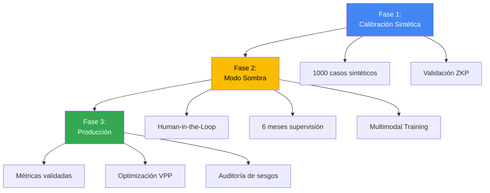

# DANIEL_AI Orion - Protocolo de Entrenamiento

**Transición de Sistema Reactivo → Ecosistema Proactivo de Triage Multimodal**

---

## 🎯 Objetivo

Entrenar y desplegar DANIEL_AI Orion como un sistema de triage inteligente que:
- Opera de forma proactiva con IA médica (Med-Gemma)
- Procesa inputs multimodales (voz, texto, imagen)
- Cumple estándares HIPAA con SafeCore/BioCore
- Optimiza recursos hospitalarios automáticamente
- Aprende continuamente de validación clínica

---

## 📊 Arquitectura de Entrenamiento



---

## 📋 Fase 1: Calibración con Datos Sintéticos

**Duración**: 2-4 semanas
**Objetivo**: Validar lógica de triage con datos controlados

### 1.1 Generación de Casos Sintéticos

**Dataset Inicial**: 1,000 casos sintéticos

| Categoría | Casos | Distribución |
|-----------|-------|--------------|
| D1 (Emergencia) | 200 | 20% |
| D2 (Urgencia) | 300 | 30% |
| D7 (Baja Complejidad) | 300 | 30% |
| D3 (Consulta) | 200 | 20% |

**Estructura de Caso Sintético**:
```json
{
  "caso_id": "SYNTH_001",
  "sintoma_principal": "dolor toracico",
  "edad": 55,
  "sexo": "M",
  "descripcion": "Dolor opresivo retroesternal de 20 min...",
  "preguntas_respuestas": {
    "¿Inicio brusco?": "si",
    "¿Irradiación?": "brazo izquierdo",
    "¿Dificultad respiratoria?": "si"
  },
  "signos_vitales": {
    "fc": 110,
    "pas": 160,
    "pad": 95,
    "spo2": 94
  },
  "clasificacion_esperada": "D1",
  "diagnostico_real": "Infarto agudo de miocardio"
}
```

### 1.2 Ingesta de Conocimiento (Excel → Med-Gemma)

**Proceso**:

1. **Extracción de Protocolos**:
   ```python
   # Cargar protocolos desde Excel procesado
   knowledge_base = load_json("data/triage_knowledge_base.json")
   
   # Extraer preguntas clave por síntoma
   for sintoma in knowledge_base:
       preguntas_clave = sintoma["preguntas_obligatorias"]
       conductas = sintoma["reglas_clasificacion"]
   ```

2. **Fine-Tuning de Med-Gemma**:
   ```python
   # Preparar dataset de entrenamiento
   training_data = []
   for caso in casos_sinteticos:
       prompt = build_training_prompt(caso)
       expected_output = caso["clasificacion_esperada"]
       training_data.append((prompt, expected_output))
   
   # Fine-tune Med-Gemma
   model.fine_tune(
       training_data=training_data,
       validation_split=0.2,
       epochs=10
   )
   ```

3. **Validación de Lógica SET/MTS**:
   - Sistema Español de Triaje (SET)
   - Manchester Triage System (MTS)
   - 5 niveles de urgencia

### 1.3 Seguridad: Zero-Knowledge Proof

**Validación Obligatoria**:
```python
# Cada caso sintético debe pasar por ZKP
for caso in casos_sinteticos:
    # Generar Bio-Hash
    bio_hash = generate_bio_hash(caso["caso_id"])
    
    # Validar elegibilidad sin exponer datos
    zkp_valid = validate_zkp(bio_hash, caso["clasificacion_esperada"])
    
    if not zkp_valid:
        raise SecurityError("Caso sintético falló validación ZKP")
    
    # Procesar solo si ZKP válido
    resultado = orion.process_triage(caso)
```

### 1.4 Métricas de Fase 1

| Métrica | Objetivo | Fórmula |
|---------|----------|---------|
| **Accuracy** | > 95% | Correctos / Total |
| **Precision D1** | > 98% | VP / (VP + FP) |
| **Recall D1** | > 99% | VP / (VP + FN) |
| **F1-Score** | > 0.96 | 2 * (P * R) / (P + R) |

**Criterio de Paso**: Todas las métricas deben cumplir objetivos.

---

## 🔄 Fase 2: Validación en Modo Sombra

**Duración**: 6 meses mínimo
**Objetivo**: Validación clínica con supervisión humana

### 2.1 Supervisión Clínica (Human-in-the-Loop)

**Arquitectura**:
```
Paciente → Orion AI → Clasificación Sugerida
                              ↓
                      [VALIDACIÓN OBLIGATORIA]
                              ↓
                    Profesional Médico → Decisión Final
                              ↓
                    Feedback Loop → Reentrenamiento
```

**Proceso**:

1. **Doble Clasificación**:
   ```python
   # Sistema paralelo
   clasificacion_ai = orion.process_triage(caso)
   clasificacion_humana = medico.clasificar(caso)
   
   # Comparar y registrar
   concordancia = (clasificacion_ai.codigo == clasificacion_humana.codigo)
   
   # Log para análisis
   log_shadow_mode(
       caso_id=caso.id,
       ai_classification=clasificacion_ai,
       human_classification=clasificacion_humana,
       concordancia=concordancia,
       tiempo_ai=clasificacion_ai.tiempo,
       tiempo_humano=clasificacion_humana.tiempo
   )
   ```

2. **Validación Obligatoria**:
   - ✅ Médico revisa **TODAS** las sugerencias de IA
   - ✅ Decisión final siempre es humana
   - ✅ IA solo sugiere, no ejecuta

3. **Feedback Loop**:
   ```python
   # Cuando hay discordancia
   if not concordancia:
       # Capturar razón de discordancia
       razon = medico.explicar_diferencia()
       
       # Agregar a dataset de reentrenamiento
       training_cases.append({
           "caso": caso,
           "clasificacion_ai": clasificacion_ai,
           "clasificacion_correcta": clasificacion_humana,
           "razon_error": razon
       })
       
       # Reentrenar semanalmente
       if len(training_cases) >= 100:
           retrain_model(training_cases)
   ```

### 2.2 Refinamiento Multimodal (Project Astra)

**Capacidades a Entrenar**:

#### A. Audio (Voz del Paciente)
```python
# Transcripción + Análisis de Tono
audio_input = capture_audio(paciente)
transcripcion = speech_to_text(audio_input)
tono_urgencia = analyze_voice_urgency(audio_input)

# Combinar con clasificación
resultado = orion.process_triage(
    input_text=transcripcion,
    audio_features={"urgencia_tono": tono_urgencia}
)
```

#### B. Visual (Fotos de Lesiones)
```python
# Análisis de imagen médica
imagen = capture_image(lesion)
caracteristicas = analyze_medical_image(imagen)

# Integrar con triage
resultado = orion.process_triage(
    input_text="Lesión cutánea",
    visual_features={
        "tipo_lesion": caracteristicas.tipo,
        "severidad_visual": caracteristicas.severidad,
        "area_afectada": caracteristicas.area
    }
)
```

#### C. Texto (Descripción Escrita)
```python
# Ya implementado en Orion
texto = paciente.describir_sintomas()
resultado = orion.process_triage(input_text=texto)
```

#### D. Fusión Multimodal
```python
# Combinar todas las modalidades
resultado_final = orion.multimodal_triage(
    audio=audio_input,
    visual=imagen,
    texto=texto,
    biometria=signos_vitales
)

# Ponderación por confianza
confianza_final = (
    0.3 * resultado_audio.confianza +
    0.3 * resultado_visual.confianza +
    0.2 * resultado_texto.confianza +
    0.2 * resultado_biometria.confianza
)
```

### 2.3 Integración BioCore

**Calibración con Signos Vitales Reales**:

```python
class BiometricIntegration:
    """Integración segura con dispositivos biométricos"""
    
    THRESHOLDS = {
        "fc_taquicardia": 100,
        "fc_bradicardia": 60,
        "pas_hipertension": 140,
        "spo2_hipoxia": 90,
        "temp_fiebre": 38.0
    }
    
    def calibrate_with_vitals(self, caso, biometria):
        """Ajusta clasificación según signos vitales"""
        
        # Detectar alertas biométricas
        alertas = []
        
        if biometria.heart_rate > self.THRESHOLDS["fc_taquicardia"]:
            alertas.append("TAQUICARDIA")
        
        if biometria.oxygen_saturation < self.THRESHOLDS["spo2_hipoxia"]:
            alertas.append("HIPOXIA")
        
        # Escalar clasificación si hay alertas críticas
        if "HIPOXIA" in alertas or "SHOCK" in alertas:
            if caso.clasificacion != "D1":
                caso.clasificacion = "D1"
                caso.razon_escalamiento = f"Escalado por: {', '.join(alertas)}"
        
        # Vincular de forma segura (HIPAA)
        bio_hash = generate_bio_hash(
            patient_id=caso.patient_id,
            biometric_data=biometria
        )
        
        return caso, bio_hash
```

### 2.4 Métricas de Fase 2

| Métrica | Objetivo | Medición |
|---------|----------|----------|
| **Concordancia AI-Humano** | > 90% | Casos coincidentes / Total |
| **Tiempo Promedio AI** | < 2 seg | Latencia de clasificación |
| **Tiempo Promedio Humano** | Baseline | Comparación de eficiencia |
| **Casos Escalados Correctamente** | > 95% | D3→D1 justificados |
| **Satisfacción Médicos** | > 4/5 | Encuesta mensual |

---

## 🚀 Fase 3: Despliegue Operativo y Aprendizaje Continuo

**Duración**: Indefinida (producción)
**Objetivo**: Sistema autónomo con supervisión reducida

### 3.1 Validación de Métricas Pre-Producción

**Criterios de Paso a Producción**:

#### A. Error Absoluto Medio (MAE)
```python
# Calcular MAE en escala de urgencia
def calculate_mae(predictions, actuals):
    urgencia_map = {"D1": 4, "D2": 3, "D7": 2, "D3": 1}
    
    errors = []
    for pred, actual in zip(predictions, actuals):
        error = abs(urgencia_map[pred] - urgencia_map[actual])
        errors.append(error)
    
    mae = sum(errors) / len(errors)
    return mae

# Objetivo: MAE < 0.15 (muy bajo error)
```

#### B. Sensibilidad (Recall) para D1
```python
# Sensibilidad = VP / (VP + FN)
# Objetivo: > 99% (no perder emergencias)

def calculate_sensitivity_d1(predictions, actuals):
    vp = sum(1 for p, a in zip(predictions, actuals) 
             if p == "D1" and a == "D1")
    fn = sum(1 for p, a in zip(predictions, actuals) 
             if p != "D1" and a == "D1")
    
    sensitivity = vp / (vp + fn) if (vp + fn) > 0 else 0
    return sensitivity
```

#### C. Especificidad para D3
```python
# Especificidad = VN / (VN + FP)
# Objetivo: > 85% (no saturar con consultas)

def calculate_specificity_d3(predictions, actuals):
    vn = sum(1 for p, a in zip(predictions, actuals) 
             if p != "D3" and a != "D3")
    fp = sum(1 for p, a in zip(predictions, actuals) 
             if p == "D3" and a != "D3")
    
    specificity = vn / (vn + fp) if (vn + fp) > 0 else 0
    return specificity
```

**Dashboard de Métricas**:
```python
def production_readiness_report():
    return {
        "mae": calculate_mae(predictions, actuals),
        "sensitivity_d1": calculate_sensitivity_d1(predictions, actuals),
        "specificity_d3": calculate_specificity_d3(predictions, actuals),
        "accuracy": calculate_accuracy(predictions, actuals),
        "f1_score": calculate_f1(predictions, actuals),
        "ready_for_production": all([
            mae < 0.15,
            sensitivity_d1 > 0.99,
            specificity_d3 > 0.85,
            accuracy > 0.95
        ])
    }
```

### 3.2 Optimización de Recursos (VPP)

**Identificación Automática de Casos VPP**:

```python
class VPPOptimizer:
    """Optimizador de Vías de Procesamiento Vertical"""
    
    VPP_ELIGIBLE_CODES = ["D7", "D3"]
    
    def suggest_vpp(self, caso, clasificacion):
        """Sugiere derivación a VPP para liberar recursos"""
        
        if clasificacion.codigo not in self.VPP_ELIGIBLE_CODES:
            return None
        
        # Criterios adicionales para VPP
        criterios_vpp = {
            "sin_comorbilidades_graves": True,
            "signos_vitales_estables": self._check_vitals_stable(caso.biometria),
            "puede_esperar_4h": True,
            "no_requiere_procedimientos_urgentes": True
        }
        
        if all(criterios_vpp.values()):
            return {
                "derivar_a_vpp": True,
                "razon": "Baja complejidad, signos vitales estables",
                "tiempo_espera_estimado": "2-4 horas",
                "recursos_liberados": ["Cama urgencias", "Personal enfermería"]
            }
        
        return None
    
    def calculate_resource_impact(self, vpp_cases_per_day):
        """Calcula impacto en recursos hospitalarios"""
        
        # Estimaciones
        tiempo_promedio_urgencias = 3  # horas
        tiempo_promedio_vpp = 1.5  # horas
        
        horas_liberadas = vpp_cases_per_day * (
            tiempo_promedio_urgencias - tiempo_promedio_vpp
        )
        
        return {
            "casos_vpp_diarios": vpp_cases_per_day,
            "horas_liberadas_diarias": horas_liberadas,
            "capacidad_adicional_d1_d2": horas_liberadas / 3,  # casos adicionales
            "ahorro_mensual_cop": horas_liberadas * 30 * 50000  # estimado
        }
```

### 3.3 Auditoría de Sesgos

**Análisis Sistemático de Equidad**:

```python
class BiasAuditor:
    """Auditor de sesgos algorítmicos"""
    
    PROTECTED_ATTRIBUTES = ["edad", "sexo", "etnia", "nivel_socioeconomico"]
    
    def audit_fairness(self, predictions, demographics):
        """Audita equidad en clasificaciones"""
        
        report = {}
        
        for attribute in self.PROTECTED_ATTRIBUTES:
            # Agrupar por atributo protegido
            groups = self._group_by_attribute(demographics, attribute)
            
            # Calcular métricas por grupo
            for group_name, group_cases in groups.items():
                group_predictions = [predictions[i] for i in group_cases]
                
                report[f"{attribute}_{group_name}"] = {
                    "total_casos": len(group_cases),
                    "d1_rate": self._calculate_rate(group_predictions, "D1"),
                    "d2_rate": self._calculate_rate(group_predictions, "D2"),
                    "tiempo_promedio": self._avg_time(group_cases)
                }
        
        # Detectar disparidades
        disparities = self._detect_disparities(report)
        
        return {
            "report": report,
            "disparities_detected": disparities,
            "action_required": len(disparities) > 0
        }
    
    def _detect_disparities(self, report):
        """Detecta disparidades significativas entre grupos"""
        
        disparities = []
        
        # Comparar tasas de D1 entre grupos
        d1_rates = {k: v["d1_rate"] for k, v in report.items()}
        max_rate = max(d1_rates.values())
        min_rate = min(d1_rates.values())
        
        # Si diferencia > 10%, hay disparidad
        if (max_rate - min_rate) > 0.10:
            disparities.append({
                "type": "D1_classification_disparity",
                "max_group": max(d1_rates, key=d1_rates.get),
                "min_group": min(d1_rates, key=d1_rates.get),
                "difference": max_rate - min_rate
            })
        
        return disparities
```

### 3.4 Aprendizaje Continuo

**Reentrenamiento Automático**:

```python
class ContinuousLearning:
    """Sistema de aprendizaje continuo"""
    
    def __init__(self):
        self.feedback_buffer = []
        self.retrain_threshold = 1000  # casos
        self.retrain_frequency = "weekly"
    
    def collect_feedback(self, caso, clasificacion_ai, clasificacion_real):
        """Recolecta feedback de casos reales"""
        
        self.feedback_buffer.append({
            "caso": caso,
            "ai_prediction": clasificacion_ai,
            "ground_truth": clasificacion_real,
            "timestamp": datetime.now(),
            "error": clasificacion_ai.codigo != clasificacion_real.codigo
        })
        
        # Reentrenar si se alcanza umbral
        if len(self.feedback_buffer) >= self.retrain_threshold:
            self.trigger_retraining()
    
    def trigger_retraining(self):
        """Dispara proceso de reentrenamiento"""
        
        print(f"🔄 Iniciando reentrenamiento con {len(self.feedback_buffer)} casos")
        
        # Preparar dataset
        training_data = self._prepare_training_data(self.feedback_buffer)
        
        # Fine-tune incremental
        model.incremental_fine_tune(
            new_data=training_data,
            learning_rate=0.0001,  # bajo para no olvidar conocimiento previo
            epochs=5
        )
        
        # Validar nuevo modelo
        metrics = self._validate_new_model()
        
        if metrics["accuracy"] > 0.95:
            print("✅ Nuevo modelo validado - Desplegando")
            self.deploy_new_model()
        else:
            print("⚠️ Nuevo modelo no cumple métricas - Revertiendo")
        
        # Limpiar buffer
        self.feedback_buffer = []
```

---

## 📊 Cronograma de Implementación

| Fase | Duración | Hitos Clave |
|------|----------|-------------|
| **Fase 1** | 2-4 semanas | 1000 casos sintéticos, Métricas > 95% |
| **Fase 2** | 6 meses | Concordancia > 90%, Multimodal OK |
| **Fase 3** | Ongoing | MAE < 0.15, Producción estable |

---

## ✅ Checklist de Validación

### Pre-Fase 1
- [ ] Dataset sintético de 1000 casos generado
- [ ] Protocolos Excel cargados en knowledge base
- [ ] SafeCore ZKP configurado
- [ ] Métricas baseline establecidas

### Pre-Fase 2
- [ ] Accuracy > 95% en casos sintéticos
- [ ] Precision D1 > 98%
- [ ] Recall D1 > 99%
- [ ] Sistema de feedback implementado

### Pre-Fase 3
- [ ] 6 meses de modo sombra completados
- [ ] Concordancia AI-Humano > 90%
- [ ] Multimodal (audio/visual/texto) funcional
- [ ] BioCore integrado y validado
- [ ] MAE < 0.15
- [ ] Sensibilidad D1 > 99%
- [ ] Especificidad D3 > 85%
- [ ] Auditoría de sesgos sin disparidades

---

**DANIEL_AI Orion** - De Reactivo a Proactivo 🚀
